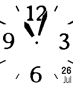
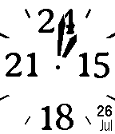

This is a pebble watch face that shows you the date in a location that
the freaking hands won't cover. The pebble is a digital watch, I don't
understand why watch face authors feel the need to make the date
unreadable 6% of the time.

Anyway. It also features a nifty-looking font, and since, again, we
are not constrained by a physical watch face, it will change the
labels to 24-hour mode in the afternoon if you've told the Pebble you
like such things.

Lastly, it vibrates if it loses the connection to the phone, which I
suppose could be handy if you ever leave your phone lying around and
mindlessly walk off.  Not that I would ever do such a thing.

